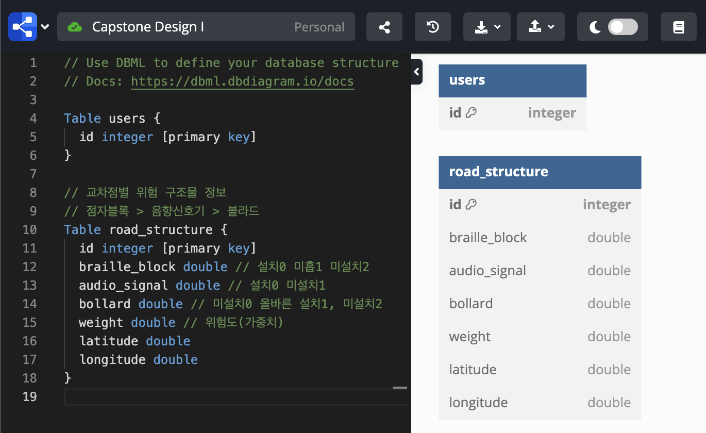

## Work Pages
[Notion - backend](https://www.notion.so/Backend-58ac040d70f445a88259659d4ba05981?pvs=4)  
[Figma - wire frame](https://www.figma.com/design/2Ze9iPebhLjcLQZB73B2hR/Wire-Frame?node-id=0-1&node-type=canvas&t=kvfpOp0nnYWQqYOI-0)  

## 실행 방법
`Python 3.12` version에서 테스트되었습니다.  

가상환경 생성 및 활성화 (필요하면 실행)
```shell
python3 -m venv .venv
source .venv/bin/activate
```

필요한 패키지 설치
```shell
pip install -r requirements.txt
```

서버 실행
```shell
# 최초 실행 시에만 필요
python3 manage.py makemigrations
python3 manage.py migrate
# 서버 실행
python3 manage.py runserver
```

## [DB ERD](https://dbdiagram.io/d/Capstone-Design-I-6709dc9597a66db9a3b8b136)  
  

## Commit Convention
|Tag Name|Description|
|:---:|:---:|
|Feat|새로운 기능을 추가|
|Fix|버그 수정|
|Design|CSS 등 사용자 UI 디자인 변경|
|!BREAKING CHANGE|커다란 API 변경의 경우|
|!HOTFIX|급하게 치명적인 버그를 고쳐야하는 경우|
|Style|코드 포맷 변경, 세미 콜론 누락, 코드 수정이 없는 경우|
|Refactor|프로덕션 코드 리팩토링|
|Comment|필요한 주석 추가 및 변경|
|Docs|문서 수정|
|Test|테스트 코드, 리펙토링 테스트 코드 추가, Production Code(실제로 사용하는 코드) 변경 없음|
|Chore|빌드 업무 수정, 패키지 매니저 수정, 패키지 관리자 구성 등 업데이트, Production Code 변경 없음|
|Rename|파일 혹은 폴더명을 수정하거나 옮기는 작업만인 경우|
|Remove|파일을 삭제하는 작업만 수행한 경우| 
